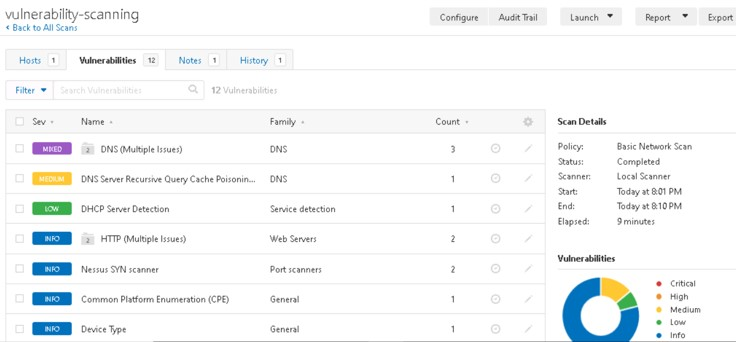

<!-- PROJECT SHIELDS -->
<!--
*** I'm using markdown "reference style" links for readability.
*** Reference links are enclosed in brackets [ ] instead of parentheses ( ).
*** See the bottom of this document for the declaration of the reference variables
*** for contributors-url, forks-url, etc. This is an optional, concise syntax you may use.
*** https://www.markdownguide.org/basic-syntax/#reference-style-links
-->

[![LinkedIn][linkedin-shield]][linkedin-url]

<!-- PROJECT LOGO -->
 

    

  <h3 align="center">Navigating a Cybersecurity Incident</h3>

<!-- TABLE OF CONTENTS -->

  
Table of Contents

  <ol>
    <li>
      <a href="#about-the-project">About The Project</a>
      <ul>
        <li><a href="#built-with">Built With</a></li>
      </ul>
    </li>
    <li><a href="#usage">Usage</a></li>
    <li><a href="#license">License</a></li>
    <li><a href="#contact">Contact</a></li>
  </ol>

<!-- ABOUT THE PROJECT -->
## About The Project

![cover]

* Project Name: Navigating a Cybersecurity Incident
* Version: v1.0.0
* Organization Department: Technology

### Description

I reviewed an incident scenario content related to a healthcare organization and
Conducted research to understand what type of threat is involved, 
who is the actor behind the threat, and how they are motivated.

I understood the vulnerabilities that were exploited within the other companies and 
Assessed our assets and current mitigating controls to confirm if the threat could be relevant to our company.

I conducted a vulnerability scan against our environment and confirmed whether 
vulnerabilities are present. 

I Attempted to exploit a weak password vulnerability and Made remediation recommendations.

I outlined the next steps required in response to the incident and recommended improvements to 
the incident response plan to address gaps.

Finally, I created a report for submission to the CISO that answers initial 
questions regarding the incident.

> This project was a milestone in my journey to study the Introduction 
to Cybersecurity Nanodegree provided by Udacity.

#### Project Overview

You are a cyber security analyst working within a healthcare organization 
called Hospital X. Your Chief Information Security Officer has reached out 
to you with a new concern.

“A new healthcare legislation was announced this morning that negatively 
impacts millions of patients around the world, and masses are outraged. 
Soon after the announcement, three different hospitals in our partner 
network were hit with ransomware attacks that shut down their entire 
operations. The FBI believes that this is not the last in the string of hits. 
All hospitals should be prepared for a potential attack. I have two questions: 
Are we vulnerable to this threat? How should we respond?”

#### Project Steps
* Review incident scenario content.
* Conduct research to understand what type of threat is involved, who is the 
actor behind the threat, and how they are motivated.
* Understand the vulnerabilities that were exploited within the other 
companies. Assess your assets and current mitigating controls to confirm if 
the threat could be relevant to your company.
* Conduct a vulnerability scan against your environment and confirm whether 
vulnerabilities are present. Attempt to exploit a weak password vulnerability. 
Make remediation recommendations.
* Outline the next steps required in response to the incident.
* Recommend improvements to the incident response plan to address gaps.
* Create a report for submission to the CISO that answers initial questions 
regarding the incident using the Final Project Template.

(<a href="#readme-top">back to top</a>)

### Built With

This project was developed using the following tech stacks:

* HashCat for Password Cracking
* Nessus Vulnerability Scanner (Free version)
* Azure Virtual Machine to Run Nessus Scanner and HashCat

(<a href="#readme-top">back to top</a>)

<!-- USAGE EXAMPLES -->
## Usage

### Screenshots

(<a href="#readme-top">back to top</a>)

<!-- LICENSE -->
## License

Distributed under the MIT License. See `LICENSE.txt` for more information.

(<a href="#readme-top">back to top</a>)

<!-- CONTACT -->
## Contact

Mohamed AbdelGawad Ibrahim - [@m-abdelgawad](https://www.linkedin.com/in/m-abdelgawad/) - +201069052620 - muhammadabdelgawwad@gmail.com

GitHub Profile Link: [https://github.com/m-abdelgawad](https://github.com/m-abdelgawad)

(<a href="#readme-top">back to top</a>)

<!-- MARKDOWN LINKS & IMAGES -->
<!-- https://www.markdownguide.org/basic-syntax/#reference-style-links -->
[linkedin-shield]: https://img.shields.io/badge/-LinkedIn-black.svg?style=for-the-badge&logo=linkedin&colorB=555
[linkedin-url]: https://www.linkedin.com/in/m-abdelgawad/
[cover]: images/cover.jpg
